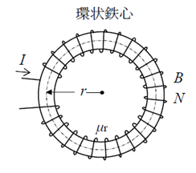
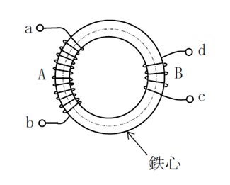
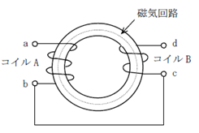

# K002：環状鉄心にコイルを巻いたときのインダクタンス、比透磁率、電流の特徴と計算

## 出題頻度

* ★★★★★(5)

## 学習のポイント

ドーナツのような形をした「環状鉄心（トロイダルコア）」の問題は、1アマの試験の電磁気分野で、形を変えてほぼ毎回のように出題される一番大切なテーマです。ここでは、次の3つのことを完ぺきに理解する必要があります。

* 磁束密度 $B$、電流 $I$、比透磁率 $\mu_r$、巻数 $N$、半径 $r$ の関係から、分からない数字を計算して導き出す。
* 同じ鉄心に2つのコイルを巻いたときの、自己インダクタンスの比率、お互いに影響し合う強さ（相互インダクタンス $M$）、2つのコイルがどれくらい強く結合しているかを表す数字（結合係数 $k$）の関係。
* 2つのコイルを直列につないだとき、磁石の向きが協力し合う（和動接合）か、邪魔し合う（差動接合）かによる、全体のインダクタンス（合成インダクタンス）の計算。

バランやトランス、フィルターといったアマチュア無線の機械の中にある部品を設計したり理解したりする上で、インダクタンスの足し算・引き算や、磁気の通り道の仕組みを正しく知ることは、とても大切な基礎知識になります。

---

## 問題の攻略方法

1アマの試験をクリアするために、次の3つの公式グループを確実にマスターしましょう。

### 1. 磁束密度から電流を導き出す公式（半径 $r$ が与えられるパターン）

ドーナツ型の鉄心の真ん中を通る半径を $r \text{ [m]}$ とすると、磁気が通る円の一周の長さ（平均磁路長）は、算数で習う「直径 $\times$ 円周率 $\pi$」と同じなので、$2\pi r$ になります。

このとき、コイルの中に生まれる磁石の強さ（磁束密度 $B \text{ [T]}$）を求める公式はこうなります。

$$B = \mu \dfrac{NI}{2\pi r} = \mu_r \mu_0 \dfrac{NI}{2\pi r}$$

* $\mu$ （ミュー）：鉄心の透磁率（磁気の通りやすさ）
* $\mu_r$ ：比透磁率（真空と比べて何倍磁気が通りやすいか）
* $\mu_0$ ：真空の透磁率（いつも $4\pi \times 10^{-7}$ という決まった数字です）
* $N$ ：コイルの巻数（何回巻いたか）
* $I$ ：流す電流 $\text{ [A]}$

この式から、電流 $I$ や比透磁率 $\mu_r$ を求める形に変形して計算します。

### 2. コイルの巻数とインダクタンスの関係

同じ鉄心にコイルを巻くとき、自己インダクタンス $L$ は「巻数 $N$ の2乗（同じ数を2回かけること）」に比例します。ここが一番間違いやすいので注意しましょう！

たとえば、巻数を $\dfrac{1}{2}$（半分）にすると、インダクタンスは半分ではなく、 $\dfrac{1}{2} \times \dfrac{1}{2} = \dfrac{1}{4}$ になります。
巻数を $3$ 倍にすると、インダクタンスは $3 \times 3 = 9$ 倍になります。

また、2つのコイル（AとB）がお互いに影響し合う強さを表す「相互インダクタンス $M$」は、次の式で計算できます。

$$M = k \sqrt{L_A L_B}$$

※1アマの問題では、磁気が外に漏れない理想的なドーナツ鉄心がよく出るので、その場合は結合係数 $k = 1$ になり、$M = \sqrt{L_A L_B}$ となります。

### 3. 2つのコイルを直列につなぐときの合成インダクタンス

2つのコイルを直列につなぐとき、電流の流れる向きによって磁石の力が強まるか、弱まるかが変わります。

- **和動接合：** 2つのコイルの磁石の向きが同じで、お互いに協力して強め合うつなぎ方です。

$$L = L_A + L_B + 2M$$

- **差動接合：** 2つのコイルの磁石の向きが逆で、お互いの力を消し合うつなぎ方です。

$$L = L_A + L_B - 2M$$

> 💡 **アドバイス1：**
> 計算をするときは、センチメートル $\text{[cm]}$ を必ずメートル $\text{[m]}$ に直しましょう！（$4 \text{ [cm]} = 0.04 \text{ [m]} = 4 \times 10^{-2} \text{ [m]}$）。  
> また、式の中に $\pi$ （パイ）がたくさん出てきますが、分数の上（分子）と下（分母）で割り算して消すことができるので、あわてて $3.14$ をかけ算しないようにしましょう。

> 💡 **アドバイス2：**
> 実際の問題では、コイルの巻き方が変化します。
> アンペアの右ねじの法則をつかって、磁束が同じ方向を向いているか、逆を向いているかしっかり見ましょう！

---

## 演習問題

それでは、実際の試験問題にチャレンジしてみましょう！

---

**問題 1 磁気回路の数値計算（比透磁率の算出）**

図に示す半径 $r = 4 \text{ [cm]}$ の環状鉄心にコイルを $250$ 回巻き、このコイルに直流電流 $I = 1 \text{ [A]}$ を流したとき、鉄心内の磁束密度 $B$ は $5 \text{ [T]}$ であった。このときの鉄心の比透磁率 $\mu_r$ の値として、最も近いものを下の番号から選べ。ただし、真空の透磁率 $\mu_0 = 4\pi \times 10^{-7} \text{ [H/m]}$ とし、コイルによって作られる磁束は鉄心中を一様に通り、鉄心には漏れ磁束及び磁気飽和はないものとする。



```
1. 1,000      2. 2,000      3. 2,500      4. 4,000      5. 5,000
```

**解法：**

磁束密度 $B$ の公式を変形して比透磁率 $\mu_r$ を求めます。

$$B = \mu_r \mu_0 \dfrac{NI}{2\pi r} \implies \mu_r = \dfrac{2\pi r B}{\mu_0 N I}$$

与えられた数値を代入します。ここで $r = 4 \text{ [cm]} = 4 \times 10^{-2} \text{ [m]}$ とすることに注意します。

$$\mu_r = \dfrac{2\pi \times (4 \times 10^{-2}) \times 5}{(4\pi \times 10^{-7}) \times 250 \times 1}$$

分母と分子の $\pi$ 及び共通因数を約分し、数値を整理します。

$$\mu_r = \dfrac{2 \times 4 \times 10^{-2} \times 5}{4 \times 10^{-7} \times 250} = \dfrac{40 \times 10^{-2}}{1,000 \times 10^{-7}} = \dfrac{0.4}{10^{-4}} = 0.4 \times 10^4 = 4,000$$

**✅ 正解：4（4,000）**

---

**問題 2 磁気回路の数値計算（必要電流の導出）**

図に示す中心半径 $r = 5 \text{ [cm]}$、比透磁率 $\mu_r = 2,000$ の環状鉄心に導線を $400$ 回巻いたコイルがある。この鉄心内部の磁束密度 $B$ を $1.6 \text{ [T]}$ にするために必要な直流電流 $I \text{ [A]}$ の値として、最も近いものを下の番号から選べ。ただし、真空の透磁率 $\mu_0 = 4\pi \times 10^{-7} \text{ [H/m]}$ とし、鉄心には漏れ磁束はないものとする。


```
1. 0.1 [A]    2. 0.2 [A]    3. 0.25 [A]    4. 0.4 [A]    5. 0.5 [A]
```

**解法：**

電流 $I$ を求めるために、公式を変形します。

$$B = \mu_r \mu_0 \dfrac{NI}{2\pi r} \implies I = \dfrac{2\pi r B}{\mu_r \mu_0 N}$$

与えられた諸元を代入します。$r = 5 \text{ [cm]} = 5 \times 10^{-2} \text{ [m]}$ を忘れないようにします。

$$I = \dfrac{2\pi \times (5 \times 10^{-2}) \times 1.6}{2,000 \times (4\pi \times 10^{-7}) \times 400}$$

まず、分母と分子にある $\pi$ を消去し、定数部分を整理します。
分子： $2 \times 5 \times 10^{-2} \times 1.6 = 10 \times 10^{-2} \times 1.6 = 0.16$
分母： $2,000 \times 4 \times 10^{-7} \times 400 = 800,000 \times 4 \times 10^{-7} = 3.2 \times 10^5 \times 2.5 \times 10^{-6}$ のようにまとめると、$(2 \times 10^3) \times (4 \times 10^{-7}) \times (4 \times 10^2) = 32 \times 10^{-2} = 0.32$ となります。

よって、求める電流 $I$ は次のようになります。

$$I = \dfrac{0.16}{0.32} = \dfrac{1}{2} = 0.5 \text [A]$$

**✅ 正解：5（0.5 [A]）**

---

**問題 3 2つのコイルのインダクタンスに関する記述（正誤判定）**

次の記述は、図に示すように、環状鉄心に二つのコイルA及びBを巻いたときのインダクタンスについて述べたものである。このうち【誤っているもの】を下の番号から選べ。ただし、Aの自己インダクタンスを $L_A \text{ [H]}$ とし、Bの巻数はAの巻数の $1/3$ とする。また、磁気回路に漏れ磁束及び磁気飽和はないものとする。



```
1. Bの自己インダクタンス L_B は、L_A / 9 [H] である。
2. AとBの間の結合係数は、1 である。
3. AとBの間の相互インダクタンス M は、L_A / 3 [H] である。
4. 端子 b と d を接続したとき、AとBによって生ずる磁束は、互いに逆の方向である。
5. 端子 b と c を接続したとき、端子 ad 間の合成インダクタンスは、4L_A / 9 [H] である。
```

**解法：**

各選択肢を一つずつ検証します。

- 1：自己インダクタンスは巻数の2乗に比例するため、$L_B = (1/3)^2 L_A = L_A / 9 \text{ [H]}$ となり正しいです。
- 2：漏れ磁束がないため、結合係数 $k = 1$ となり正しいです。
- 3：相互インダクタンス $M = k\sqrt{L_A L_B} = 1 \times \sqrt{L_A \times (L_A/9)} = L_A / 3 \text{ [H]}$ となり正しいです。
- 4：図の巻き方を見ると、端子aから入った電流と端子dから入った電流は、アンペアの右ねじの法則より、Aは時計回りに、Bは、反時計回りに磁束を作ります。したがって、bとdを接続してa→b(d)→cと電流を流すと、生じる磁束は互いに逆の方向（差動接合）になり、正しい記述です。
- 5：bとcを接続してad間を測定する場合、アンペアの右ねじの法則より、A、Bともに時計回りに磁束を作ります。したがって、bとcを接続してa→b(c)→dと電流を流すと、生じる磁束は互いに同方向（和動接合）に働きます。
したがって、合成インダクタンス $L$ は以下のようになります。

$$L = L_A + L_B + 2M = L_A + \dfrac{1}{9}L_A + 2\left(\dfrac{1}{3}L_A\right) = \left(1 + \dfrac{1}{9} + \dfrac{2}{3}\right)L_A = \left(\dfrac{9+1+6}{9}\right)L_A = \dfrac{16}{9}L_A \text{ [H]}$$

選択肢の $4L_A / 9$ は誤りです。

**✅ 正解：5**

---

**問題 4 直列合成インダクタンスの数値計算**

図に示すように、環状鉄心に巻いた二つのコイルA及びBを接続したとき、端子ad間のインダクタンスの値として、最も近いものを下の番号から選べ。ただし、Aの自己インダクタンスは $40 \text{ [mH]}$、Bの巻数はAの $1/2$ とする。また、磁気回路には漏れ磁束はないものとする。



```
1. 10 [mH]    2. 30 [mH]    3. 45 [mH]    4. 75 [mH]    5. 90 [mH]
```

**解法：**

まず、コイルBの自己インダクタンス $L_B$ と、相互インダクタンス $M$ を求めます。
巻数比が $N_B / N_A = 1/2$ なので、

$$L_B = \left(\dfrac{1}{2}\right)^2 \times L_A = \dfrac{1}{4} \times 40 = 10 \text{ [mH]}$$

$$M = \sqrt{L_A L_B} = \sqrt{40 \times 10} = \sqrt{400} = 20 \text{ [mH]}$$

次に、回路の接続状態（和動か差動か）を確認します。
図を見ると、端子bと端子cが接続されています。電流が端子aから入ると、コイルAを通り端子bから出て、そのまま端子cへ入り、コイルBを通って端子dから出ていきます。
コイルAとコイルBの巻き方向を鉄心に沿って追いかけると、aから入る電流とcから入る電流は、アンペアの右ねじの法則より、鉄心内部において**同じ方向の磁束**を生み出します。したがって、この接続は「和動接合」です。

和動接合の合成インダクタンス公式に値を代入します。

$$L = L_A + L_B + 2M = 40 + 10 + 2 \times 20 = 50 + 40 = 90 \text{ [mH]}$$

**✅ 正解：5（90 [mH]）**