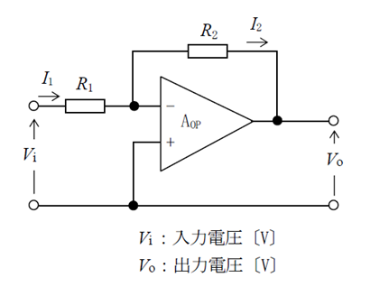

# K043：演算増幅器（オペアンプ）を用いた反転増幅回路の基本特性

## 出題頻度

- ★★★★★(5)

## 学習のポイント

2アマの試験で学んだ「オームの法則」や「抵抗」の知識があれば、とてもすっきりと理解できる回路です。オペアンプという便利な電子部品を使った「反転増幅回路」が、なぜ電気の信号を大きくできるのか、その仕組みを直感的に解き明かしていきます。

無線機の中では、マイクから入ってきた小さな音声信号を大きくしたり、余計なノイズをカットして相手の声を聴き取りやすくしたりする大切な役割を持っています。難しい数式を丸暗記するのではなく、「電気がどのルートを通って流れるか」というパズルのように考えると、回路の動きが自然と見えてきます。
## 出題頻度

* ★★★★★(5)

---

## 学習のポイント

2アマの試験で学んだ「オームの法則」や「抵抗」の知識があれば、とてもすっきりと理解できる回路です。オペアンプという便利な電子部品を使った「反転増幅回路」が、なぜ電気の信号を大きくできるのか、その仕組みを直感的に解き明かしていきます。

オペアンプは、具体的に、アマチュア無線機の中で以下のような場面で活躍しています。

* **マイクアンプ（音声増幅）**：マイクが拾ったそのままの状態では小さすぎる音声の信号を、送信機をきれいにコントロールできる大きさまで大きくします。
* **アクティブフィルター（ノイズ除去）**：受信機の中で、音声に混ざってしまった「サー」という高い音のノイズや「ブーン」という低い電源のノイズをカットして、相手の声をはっきりと聴き取りやすくします。
* **低周波増幅（AFアンプ）**：電波から取り出したばかりの音声信号（低周波信号）はまだ力が弱いので、スピーカーやイヤホンをしっかりと鳴らせる強さまで大きくします。

この問題では、こうした様々な回路の土台となる、オペアンプの最も基本的な「反転増幅回路」の動作原理と、理想的なオペアンプが持つ性質についての理解を問うています。

回路の基礎をベースに、オペアンプ特有の性質を理解することで、一見難しそうに見える増幅回路の計算がとてもシンプルに行えるようになります。

---

## 問題の攻略方法

反転増幅回路の問題が出されたときは、次の3つのルールを思い出すとスムーズに解答へたどり着くことができます。

1. **オペアンプの入り口には電流が流れない**
* オペアンプの入力インピーダンス（入り口の抵抗）は無限に大きいため、＋と－の端子の中に電気が吸い込まれることはありません。流れてきた電流は、すべて外側の抵抗（$R_2$）へと通り抜けます。


2. **＋と－の電圧はいつでも同じになる**
* 負帰還（出力を入り口に戻す仕組み）がかかっているとき、＋端子と－端子の電圧はぴったり同じになります。＋端子が接地（0V）されているなら、－端子も自動的に0V（仮想接地）になります。


3. **増幅の大きさは「出口の抵抗 ÷ 入り口の抵抗」で、形はひっくり返る**
* 電圧が何倍になるかの大きさは $\frac{R_2}{R_1}$ です。
* －端子に信号を入れているため、出力される電気の波のプラスとマイナス（上下）が完全にひっくり返ります（逆位相、または位相が $\pi$ [rad] ずれる）。


---

## 解説

理想的なオペアンプ（演算増幅器 $A_{OP}$）を用いた反転増幅回路が動く仕組みを、順を追って解説します。

### 1. 理想的なオペアンプの性質

オペアンプは、2つの入り口（＋と－）に入ってきた電圧の「差」を、何万倍にも大きくして出口から出すことができる部品です。
試験で問われる「理想的なオペアンプ」には、回路の計算をシンプルにするための都合の良い性質があります。

* **入力インピーダンスが無限大**：入り口の抵抗が無限に大きいため、端子の中に電流は一切流れません。
* **出力インピーダンスがゼロ**：出口の抵抗がゼロなので、電力をスムーズに次の回路へ送り出せます。

### 2. 電圧が同じになる仕組み（仮想接地）

出口の電圧を、抵抗 $R_2$ を通して－端子へと戻しています。これを「負帰還」と呼びます。
負帰還がかかっていると、オペアンプは「＋端子と－端子の電圧の差がゼロ（同じ電圧）」になるように、自動的に出口の電圧を調整してバランスを保ちます。
今回の回路では＋端子が接地（0V）されているため、－端子も引っ張られるようにして自動的に0Vになります。これを見かけ上の接地（仮想接地、またはイマジナリーショート）と呼びます。

### 3. 各部の電流と電圧の関係



* **電流は一本道 ($I_1 = I_2$)**  
入力電圧 $V_i$ から出発した電流 $I_1$ は、抵抗 $R_1$ を通ってオペアンプの－端子に向かいます。しかし、オペアンプの内部には電流が流れ込めないため、－端子の手前で行き止まりになります。その結果、電流はすべて上側の抵抗 $R_2$ を通るルートへと進みます。したがって、2つの電流は同じ大きさ（$I_1 = I_2$）になります。
* **出力電圧 $V_o$ の決まり方**  
オペアンプの－端子は「0V」です。ここから抵抗 $R_2$ を通って、出口である $V_o$ に向かって電流 $I_2$ が流れていきます。  
オームの法則（電圧 ＝ 電流 × 抵抗）を使うと、抵抗 $R_2$ を通ることで $I_2 \times R_2$ だけ電圧が下がります。
0Vの地点から電流の流れる方向へ進んで電圧が下がるため、出口の電圧 $V_o$ は以下のようになります。

$$V_o = 0 - I_2 \times R_2 = -I_2 \times R_2$$


* **電圧増幅度の計算**  
最初に入ってきた電圧 $V_i$ から見ると、－端子の場所が0Vなので、抵抗 $R_1$ の両端にかかる電圧は $V_i$ そのものです。  
オームの法則より、
$$V_i = I_1 \times R_1$$


 となります。電流が同じ（$I_1 = I_2$）であることを利用すると、
$$V_i = I_2 \times R_1$$


 と書き換えることができます。  
「出口の電圧」が「入り口の電圧」の何倍になったか（電圧増幅度 $\frac{V_o}{V_i}$）を計算してみます。

$$\frac{V_o}{V_i} = \frac{-I_2 \times R_2}{I_2 \times R_1} = -\frac{R_2}{R_1}$$


マイナスを除いた「増幅の大きさ（絶対値）」で見ると、$\frac{R_2}{R_1}$ 倍になっていることが分かります。
* **位相の反転**  
計算結果にマイナス（$-$）がついているのは、入り口の電圧がプラスのときは出口がマイナスになり、入り口がマイナスのときは出口がプラスになるという関係を表しています。
交流の波で表すと、山と谷が完全にひっくり返った形になります。これを「逆位相」と呼び、角度の単位（ラジアン）で表すと **$\pi$ [rad]** （180度）ずれていることになります。

---

## 演習問題

**問題 1 [B問題形式]**

次の記述は、図に示す理想的な演算増幅器 $A_{OP}$ を用いた増幅回路について述べたものである。［ ア ］〜［ オ ］内に入れるべき字句を下の番号から選べ。ただし、入力電圧を $V_i$ [V]とし、抵抗 $R_1$ [Ω]及び $R_2$ [Ω]に流れる電流をそれぞれ $I_1$ [A]及び $I_2$ [A]とする。


(1) $A_{OP}$ 単体の入力インピーダンスは非常に［ ア ］。  
(2) $I_1$ と $I_2$ の関係は、$I_1 = $ ［ イ ］ である。  
(3) 出力電圧 $V_o$ は、$V_o = -I_2 \times $ ［ ウ ］ [V] である。  
(4) 回路の電圧増幅度 $\left|\frac{V_o}{V_i}\right|$ を $R_1$ と $R_2$ で表すと、［ エ ］である。  
(5) 出力電圧の位相は入力電圧の位相と［ オ ］である。

**選択肢：**  
1 大きい　　2 $2I_2$　　 3 $R_2$　　　　　　4 $\frac{R_1}{R_2}$　　5 同位相  
6 小さい　　7 $I_2$　　　8 $(R_1 + R_2)$　　9 $\frac{R_2}{R_1}$　　10 逆位相  

**解法：**  
(1) 理想的な演算増幅器の入力インピーダンスは「大きい」（無限大）であるため、［ ア ］には **1** が入ります。

(2) オペアンプの入力端子には電流が流れ込まないため、抵抗 $R_1$ を流れる電流 $I_1$ はすべて抵抗 $R_2$ に流れます。したがって $I_1 = I_2$ となり、［ イ ］には **7** が入ります。

(3) 仮想接地により反転入力端子の電位は0Vです。ここから電流 $I_2$ が抵抗 $R_2$ を通って出力端子へ流れるため、出力電圧は $V_o = -I_2 \times R_2$ となります。したがって、［ ウ ］には **3** が入ります。

(4) 入力電圧は $V_i = I_1 R_1 = I_2 R_1$ であり、出力電圧の絶対値は $|V_o| = I_2 R_2$ です。これより、電圧増幅度の大きさは $\left|\frac{V_o}{V_i}\right| = \frac{I_2 R_2}{I_2 R_1} = \frac{R_2}{R_1}$ となり、［ エ ］には **9** が入ります。

(5) 反転入力端子に信号を入力しているため、出力の位相は入力とひっくり返った「逆位相」になります。したがって、［ オ ］には **10** が入ります。

**✅正解：ア：1、イ：7、ウ：3、エ：9、オ：10**

---

**問題 2 [A問題形式（基本諸元）]**

次の記述は、図に示す回路について述べたものである。［ A ］〜［ C ］内に入れるべき字句の正しい組合せを下の番号から選べ。ただし、$A_{OP}$は理想的な演算増幅器を示す。


(1) 回路の増幅度 $A = |V_o / V_i|$ は ［ A ］ である。  
(2) 回路の $V_o$ と $V_i$ の位相差は ［ B ］ [rad] である。  
(3) 回路は ［ C ］ 増幅回路と呼ばれる。

**選択肢：**

```text
      A          B        C
1   R1/R2      π       非反転(同相)
2   R1/R2      π/2     反転(逆相)
3   R2/R1      π/2     反転(逆相)
4   R2/R1      π/2     非反転(同相)
5   R2/R1      π       反転(逆相)
```

*(※注：試験の回によって選択肢の並び順が異なる場合がありますが、正しい組み合わせの内容は同一です)*

**解法：**  
(1) 反転増幅回路の電圧増幅度の絶対値 $A$ は、帰還抵抗 $R_2$ を入力抵抗 $R_1$ で割った値、すなわち $A = \frac{R_2}{R_1}$ となります。したがって、［ A ］は $\frac{R_2}{R_1}$ です。

(2) 反転増幅回路では、出力電圧の位相が入力電圧に対して180度（$\pi$ [rad]）ずれます。したがって、［ B ］は $\pi$ です。

(3) 入力信号の位相を反転させて増幅する回路であるため、「反転（逆相）」増幅回路と呼ばれます。したがって、［ C ］は「反転（逆相）」です。

これらがすべて一致する組み合わせは **5** となります。

**✅正解：5**

---

**問題 3 [A問題形式（電流・電圧式）]**

次の記述は、図に示す理想的な演算増幅器 $A_{OP}$ を用いた増幅回路について述べたものである。［ A ］〜［ C ］内に入れるべき字句の正しい組合せを下の番号から選べ。ただし、入力電圧を $V_i$ [V] とし、抵抗 $R_1$ [Ω] 及び $R_2$ [Ω] に流れる電流をそれぞれ $I_1$ [A] 及び $I_2$ [A] とする。


(1) $I_1$ と $I_2$ の関係は、$I_1 = $ ［ A ］ である。  
(2) 出力電圧 $V_o$ は、$V_o = -I_2 \times $ ［ B ］ [V] である。  
(3) したがって、回路の電圧増幅度 $V_o/V_i$ は、$V_o/V_i = -($ ［ C ］ ) である。

**選択肢：**

```text
      A          B              C
1   I2         (R1 + R2)      R2/R1
2   I2         R2             R2/R1
3   I2         (R1 + R2)      1 + R2/R1
4   2I2        R2             1 + R2/R1
5   2I2        (R1 + R2)      R2/R1
```

**解法：**  
(1) 理想的なオペアンプの入力端子には電流が流れないため、抵抗 $R_1$ を流れる電流 $I_1$ はそのまま抵抗 $R_2$ を流れる電流 $I_2$ に等しくなります（$I_1 = I_2$）。よって［ A ］は $I_2$ です。

(2) 仮想接地により反転入力端子（－）の電位は0Vとみなせます。この0Vの点から電流 $I_2$ の方向に沿って抵抗 $R_2$ を通った先の電圧が出力電圧 $V_o$ となるため、オームの法則より $V_o = 0 - I_2 R_2 = -I_2 R_2$ となります。よって［ B ］は $R_2$ です。

(3) 入力電圧は $V_i = I_1 R_1 = I_2 R_1$ と表されるため、回路全体の電圧増幅度 $V_o/V_i$ は、

$$\frac{V_o}{V_i} = \frac{-I_2 R_2}{I_2 R_1} = -\frac{R_2}{R_1}$$

となります。したがって、［ C ］は $R_2 / R_1$ です。
これらがすべて一致する組み合わせは **2** となります。

**✅正解：2**
